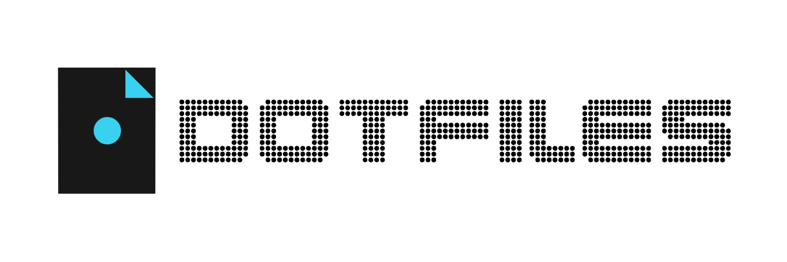
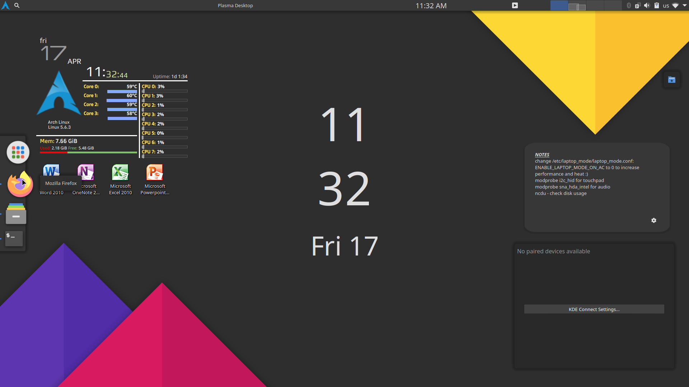
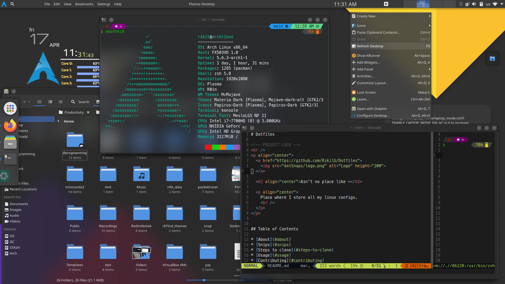
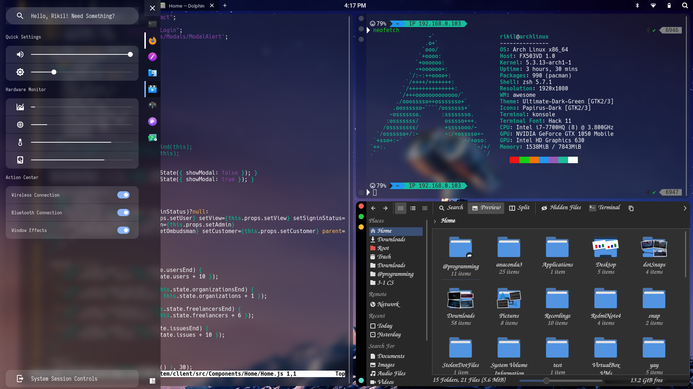
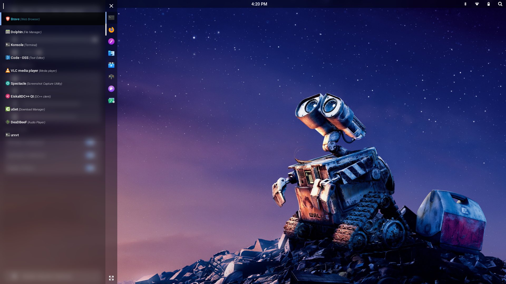
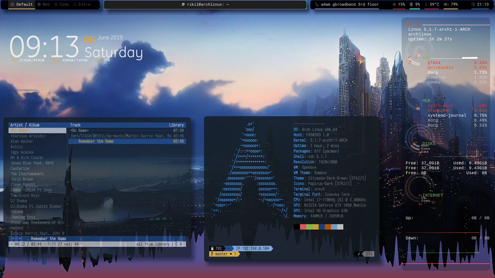

# Dotfiles

<!-- PROJECT LOGO -->
<br />
<p align="center">
    <a href="https://github.com/RikilG/Dotfiles">
        
    </a>
    <h2 align="center">Ain't no place like ~</h2>
    <p align="center">
        Place where I store all my linux configs.
        <br />
    </p>
</p>


## Table of Contents

* [About](#about)
* [Steps to clone](#steps-to-clone)
* [Tools Used](#tools-used)
* [Snips](#snips)
* [Contributing](#contributing)
* [License](#license)


## About
This repository is home to all my (written and copied)linux configuration files(rather dotfiles). 
Feel free to clone and copy if you like anything. All this configuration files are currently sheltered on a system running Arch Linux.


## Steps to clone
 
Clone the Dotfiles:
```sh
git clone https://github.com/RikilG/Dotfiles.git
cd Dotfiles
```


## Tools Used

- neovim
    Have a look at my config [here](.config/nvim/init.vim)
- zsh
    Using oh-my-zsh and powerline10k
- firefox
- kde


## Snips
### KDE - Currently using

<br/>

### AwesomeWM - My Favourite
Look at [manilarome's dotfiles](https://github.com/manilarome/the-glorious-dotfiles) for more updated version and variations.

<br/>

### OpenBox - My first shot at Ricing



## License

Distributed under the MIT License. See `LICENSE` for more information.
