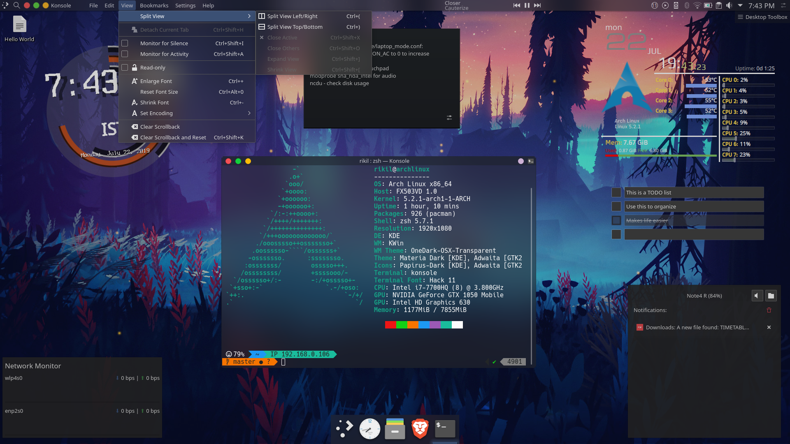

# Dotfiles

<!-- PROJECT LOGO -->
<br />
<p align="center">
  <a href="https://github.com/RikilG/Dotfiles">
    
  </a>

  <h2 align="center">Ain't no place like ~</h2>

  <p align="center">
    Place where I store all my linux configs.
    <br />
  </p>
</p>


## Table of Contents

* [About](#about)
* [Snips](#snips)
* [Steps to clone](#steps-to-clone)
* [Usage](#usage)
* [Contributing](#contributing)
* [License](#license)

## About
This repository is home to all my linux configuration files. Feel free to clone and copy if you like anything.  
All this configuration files are currently sheltered on a system running Arch Linux.

## Snips




## Steps to clone
 
Clone the Dotfiles:
```sh
git clone https://github.com/RikilG/Dotfiles.git
cd Dotfiles
```

## License

Distributed under the MIT License. See `LICENSE` for more information.
